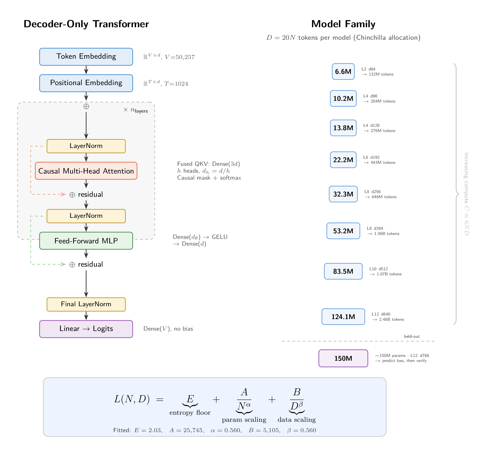
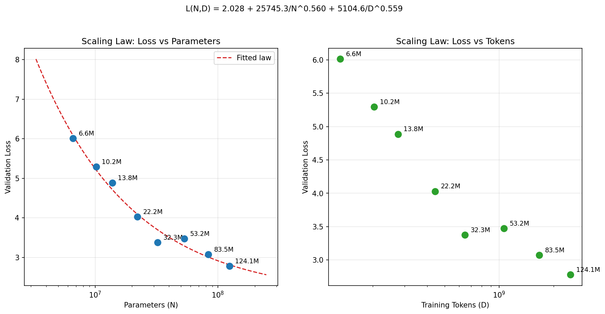
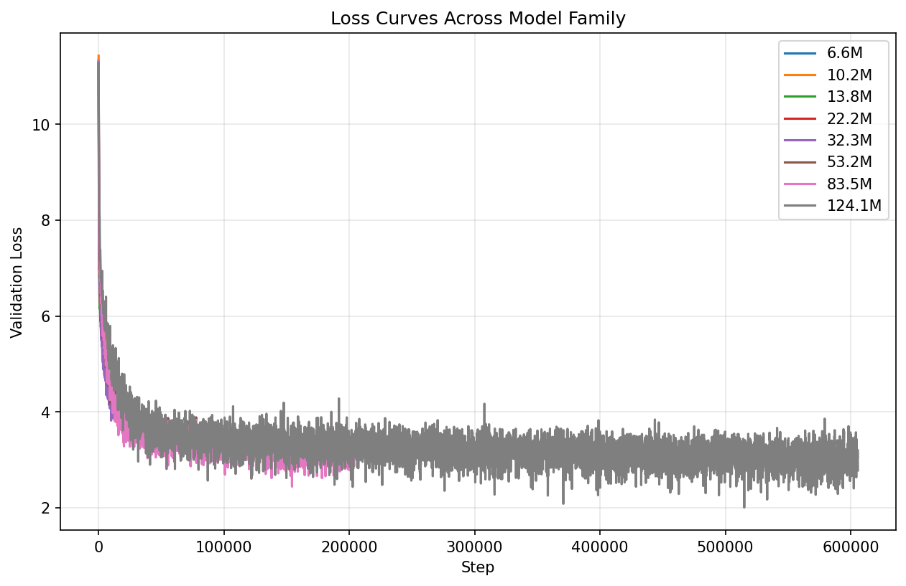
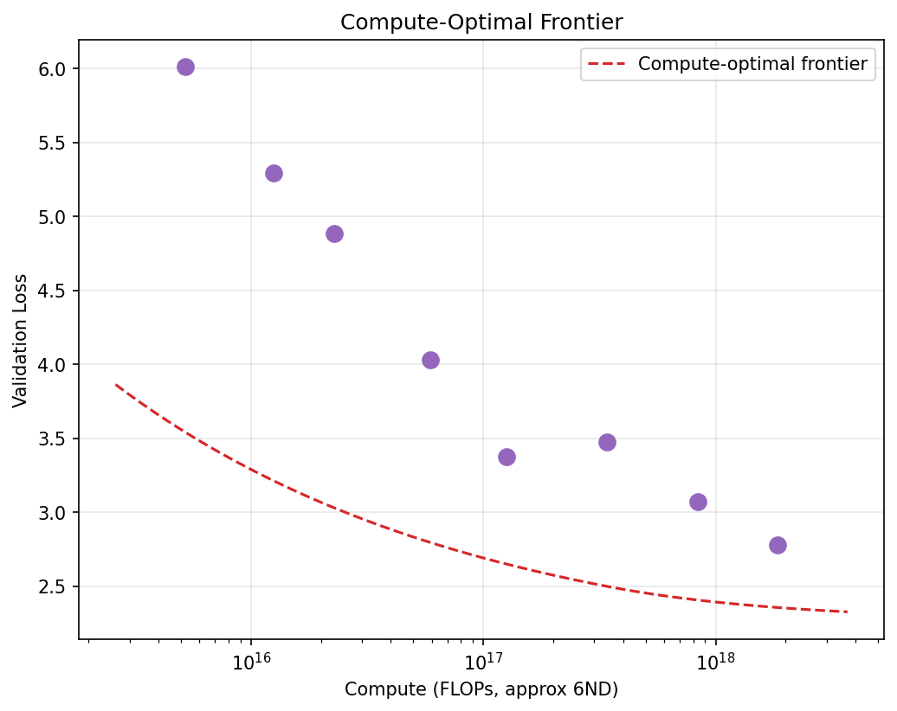

# Scaling Laws for Neural Language Models in JAX

An empirical study of compute-optimal scaling laws for transformer language models, implemented from scratch in JAX/Flax. We train a family of decoder-only transformers spanning two orders of magnitude (6.6M to 124M parameters), fit the Chinchilla parametric scaling law to the observed losses, and use the fitted law to predict the performance of a held-out ~150M-parameter model before training it.

## Motivation

Hoffmann et al. (2022) showed that for a fixed compute budget, there exists an optimal allocation between model size $N$ and training data $D$, known as the "Chinchilla" result. This project replicates that finding at small scale: we train enough models to recover the scaling exponents, then test whether the fitted law generalizes to an unseen model size.

The entire stack is built in JAX to exercise the functional transformation paradigm (`jit`, `grad`, `value_and_grad`) that underpins modern large-scale training infrastructure.

## Approach

### 1. Transformer Architecture

Each model is a GPT-2-style decoder-only transformer implemented in Flax Linen. The architecture is parameterized by four knobs (`n_layers`, `d_model`, `n_heads`, `d_ff`) so model size is a clean function of configuration:



Key architectural choices for clean scaling signal:
- **Pre-LayerNorm** residual connections (more stable than post-LN at small scale)
- **No dropout:** eliminates stochastic noise from loss curves
- **Learned positional embeddings** over 1024-token context
- **No weight tying** between embedding and output projection

### 2. Model Family

We define 8 training configurations plus one held-out model, scaling both width and depth together (log-spaced in parameter count). Each model trains on exactly $D = 20N$ tokens, following the Chinchilla-recommended compute allocation where parameters and data scale in proportion. The full model family is shown in the diagram above.

### 3. Training Pipeline

All models share an identical training recipe to avoid confounds in the scaling fit:

- **Optimizer:** AdamW ($\beta_1=0.9, \beta_2=0.999$, weight decay $= 0.1$)
- **Schedule:** Cosine decay with 5% linear warmup, peak LR $3 \times 10^{-4}$ to $3 \times 10^{-5}$
- **Loss:** Cross-entropy (next-token prediction) via `optax.softmax_cross_entropy_with_integer_labels`
- **JIT compilation:** Train step is a `@jax.jit`-compiled closure over the model and optimizer, avoiding unhashable Flax modules as traced arguments
- **Batch size:** Scaled per model (32 to 4) to fit consumer GPU memory

### 4. Data

WikiText-103 tokenized with GPT-2 BPE (`tiktoken`, vocab size 50,257). Stored as flat `uint16` `.npy` arrays with memory-mapped reads (`mmap_mode="r"`) for zero-copy random access. 95/5 train/val split aligned to 1024-token block boundaries.

## Results

### Scaling Law Fit

We fit the Chinchilla parametric form via `scipy.optimize.curve_fit`:

$$L(N, D) = E + \frac{A}{N^\alpha} + \frac{B}{D^\beta}$$

| Coefficient | Fitted Value | Interpretation |
|---|---|---|
| $E$ | 2.0279 | Irreducible loss (data entropy floor) |
| $A$ | 25,745.32 | Parameter-scaling prefactor |
| $\alpha$ | 0.5598 | Parameter-scaling exponent |
| $B$ | 5,104.58 | Data-scaling prefactor |
| $\beta$ | 0.5595 | Data-scaling exponent |

The near-equal exponents ($\alpha \approx \beta \approx 0.56$) confirm that parameters and data contribute roughly symmetrically to loss reduction, consistent with Chinchilla's central finding that models and data should scale in tandem rather than training smaller models on more tokens.



### Training Loss Curves

Validation loss across all 8 models over training. Larger models reach lower loss but require proportionally more compute (tokens):



### Compute-Optimal Frontier

For a given compute budget $C \approx 6ND$ (FLOPs), the fitted law yields an optimal parameter count $N^*$ and token count $D^*$ that minimizes loss. Points above the frontier represent suboptimal allocations: either over-parameterized (too few tokens per param) or under-parameterized (wasted compute on a model too small to absorb it).



### Held-Out Prediction (150M)

| Metric | Parameters | Tokens | Val Loss |
|---|---|---|---|
| **Predicted** | ~150M | | |
| **Actual** | ~150M | | |
| **Error** | | | % |

Pending: run `python -m analysis.predict_and_verify` to train the 150M model and verify the prediction.

## Implementation Details

### JAX Ecosystem

The project uses JAX end-to-end with no PyTorch dependencies:

| Library | Role |
|---|---|
| **JAX** | Functional autodiff, JIT compilation, pytree operations |
| **Flax Linen** | `nn.Module` system with `@nn.compact`, params are explicit pytrees |
| **Optax** | Composable optimizer chains (AdamW + cosine schedule) |
| **tiktoken** | GPT-2 BPE tokenization |
| **scipy** | `curve_fit` for scaling law regression |

### Compute Optimization

The 8-model sweep runs comfortably on a single GPU, but the held-out 150M verification run at ~3B tokens presents a compute bottleneck. We address this with three complementary strategies: activation rematerialization, multi-GPU data parallelism, and bfloat16 mixed precision.

**Activation rematerialization (gradient checkpointing).** The dominant memory cost during training is not the model parameters but the intermediate activations stored for the backward pass. A 150M-param transformer with 12 layers at batch 128 stores attention matrices of shape `(batch, heads, 1024, 1024)` per layer, totaling hundreds of gigabytes across all layers simultaneously. We apply Flax's `nn.remat` to each transformer block, which discards intermediate activations during the forward pass and recomputes them on-the-fly during backpropagation:

```python
RematBlock = nn.remat(TransformerBlock)
for _ in range(cfg.n_layers):
    x = RematBlock(cfg)(x, deterministic)
```

This trades ~30% additional compute for a ~10x reduction in activation memory: instead of storing all 12 layers' activations simultaneously, only one layer's worth exists in memory at any time. This is what enables batch 128/device on 32GB GPUs, which would be impossible otherwise.

| Component | Without remat | With remat |
|---|---|---|
| Stored activations (batch 128) | 128 x 300MB x 12 layers = ~450GB | 128 x 50MB x 1 layer = ~6.4GB |
| Block inputs for recompute | N/A | 128 x 19MB = ~2.4GB |
| Compute overhead | Baseline | ~30% more FLOPs |

**Automatic multi-device detection.** The training step auto-detects available devices at launch. With a single GPU it compiles via `@jax.jit` as normal. With multiple GPUs it switches to `@jax.pmap`, replicating model parameters on each device, sharding the batch, and synchronizing gradients via `lax.pmean`:

```python
n_devices = jax.local_device_count()

if n_devices > 1:
    @jax.pmap(axis_name='batch')
    def train_step(params, x, y, opt_state):
        loss, grads = jax.value_and_grad(loss_fn)(params)
        grads = jax.lax.pmean(grads, axis_name='batch')
        updates, opt_state = tx.update(grads, opt_state, params)
        params = optax.apply_updates(params, updates)
        return params, opt_state, loss
else:
    @jax.jit
    def train_step(params, x, y, opt_state):
        ...
```

Batch size scales automatically with device count (e.g. 64 per device x 2 GPUs = 128 effective), doubling throughput with near-linear scaling.

**bfloat16 mixed precision.** Enabled via `use_bf16=True`, the training loop casts all float32 parameters to bfloat16 before training begins. This halves memory per parameter (~300MB instead of ~600MB for 150M params), allowing larger batch sizes and faster matmuls on hardware with bf16 tensor cores (A100, 3090, 4090). The loss computation remains numerically stable since cross-entropy accumulation happens in higher precision internally.

**Why data parallelism over FSDP/tensor parallelism.** The 150M model fits comfortably in a single GPU's memory, so there is no need to shard the model itself. FSDP (sharding parameters across devices) and tensor parallelism (splitting individual layers across devices) solve a different problem: fitting models too large for one device's memory. At 150M parameters that constraint does not apply, and the communication overhead of sharding params would hurt more than it helps.

**Estimated training time for the 150M verification run (bf16 + remat, ~3B tokens):**

| Setup | Batch/device | Total batch | Steps | Time |
|---|---|---|---|---|
| 1x T4 (Kaggle/Colab) | 16 | 16 | ~199K | ~6-8 hrs |
| 2x T4 (Kaggle) | 16 | 32 | ~99K | ~3-4 hrs |
| 2x 3090 (Vast.ai) | 64 | 128 | ~24K | ~30-45 min |
| 2x 5090 (RunPod) | 128 | 256 | ~12K | ~10-20 min |

We use 2x RTX 5090 on RunPod ($0.99/hr per GPU) for the held-out verification run. Activation rematerialization enables batch 128/device on 32GB cards, keeping total training time under 20 minutes.

### Fault Tolerance

- **Checkpointing every 500 steps:** serializes full state (params, optimizer, RNG, training log) via pickle. Supports resume from crash or Colab timeout.
- **Incremental sweep saves:** `sweep_results.json` is written after each model completes, so partial sweeps are never lost.
- **Deterministic RNG:** `numpy.random.default_rng` with saved/restored state for exact reproducibility across restarts.

## Project Structure

```
scaling-laws/
├── data/
│   ├── prepare_data.py          # download WikiText-103, tokenize, save as .npy
│   └── loader.py                # mmap loader + random batch sampler
├── model/
│   ├── transformer.py           # decoder-only transformer (Flax Linen)
│   └── init.py                  # exact param count via dummy forward pass
├── train/
│   ├── train_step.py            # @jax.jit train/eval steps, cross-entropy loss
│   └── run_training.py          # training loop, optimizer, checkpointing
├── sweep/
│   ├── model_family.py          # 8 configs (3M–110M) + held-out 150M
│   └── run_sweep.py             # full sweep with incremental saves
├── analysis/
│   ├── fit_scaling_law.py       # fit L(N,D), generate scaling plots
│   └── predict_and_verify.py    # predict + train held-out 150M
└── results/
    ├── sweep_results.json       # per-model training logs
    ├── scaling_law_coeffs.json  # fitted {E, A, α, B, β}
    └── plots/                   # loss_curves, scaling_law, compute_optimal
```

## Reproducing

```bash
pip install jax[cuda12] flax optax tiktoken datasets scipy numpy matplotlib

python -m data.prepare_data           # 1. download + tokenize WikiText-103
python -m sweep.run_sweep             # 2. train all 8 models (resumable)
python -m analysis.fit_scaling_law    # 3. fit scaling law + generate plots
python -m analysis.predict_and_verify # 4. predict + verify held-out 150M
```

For CPU-only or Colab, replace `jax[cuda12]` with `jax`.

## References

- Hoffmann et al. 2022, [Training Compute-Optimal Large Language Models](https://arxiv.org/abs/2203.15556) (Chinchilla)
- Kaplan et al. 2020, [Scaling Laws for Neural Language Models](https://arxiv.org/abs/2001.08361)
- Karpathy, [nanoGPT](https://github.com/karpathy/nanoGPT)
- [The Scaling Book](https://jax-ml.github.io/scaling-book/): JAX-specific scaling guide
